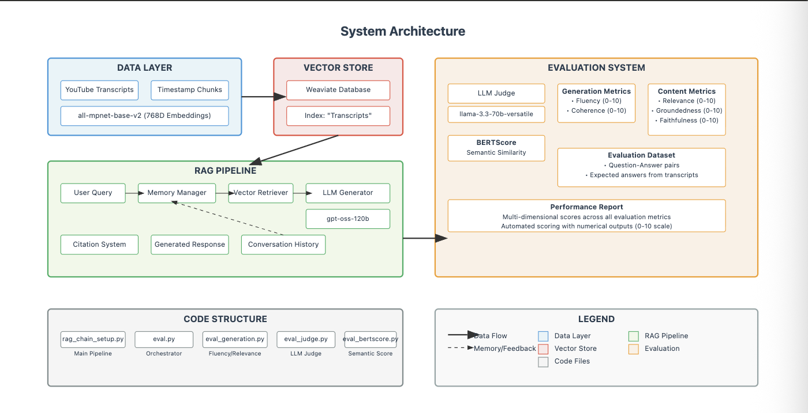

Overview
A Retrieval-Augmented Generation (RAG) system with comprehensive evaluation framework designed for querying and analyzing YouTube video transcripts with systematic performance measurement.

Problem Statement
The Challenge

Information Retrieval Gap: YouTube video transcripts contain valuable information but are difficult to search and extract insights from effectively
RAG Quality Uncertainty: Without proper evaluation, it's impossible to know if the RAG system is providing accurate, relevant, and trustworthy responses
Performance Measurement: Need systematic ways to measure response quality across multiple dimensions (fluency, relevance, groundedness, faithfulness)

Why This Matters

Video content is growing exponentially but remains largely unsearchable
Users need quick, accurate answers from video content without watching entire videos
RAG systems can hallucinate or provide irrelevant information without proper evaluation
Building trustworthy AI systems requires robust evaluation frameworks

Solution Overview
High-Level Approach
This system combines Retrieval-Augmented Generation with Multi-Metric Evaluation to create a reliable question-answering system for video transcripts.

System Architecture

Main Components

Vector Store (Weaviate) - stores video transcript embeddings
RAG Chain - retrieves context and generates answers
Evaluation System - measures response quality

Simple Flow
Question → Find relevant transcript parts → Generate answer → Evaluate quality

Key Technologies

Weaviate: Vector database for storing transcript chunks
HuggingFace: Text embeddings (all-mpnet-base-v2)
Groq: LLM for answer generation (gpt-oss-120b)
LLM Judge: Different model for evaluation (llama-3.3-70b-versatile)

Key Implementation Decisions
Embedding Strategy

Model: sentence-transformers/all-mpnet-base-v2
Dimensions: 768-dimensional vectors
Why this model:

High performance on semantic similarity tasks
Good balance between quality and speed
Well-tested for retrieval applications

Chunking: Uses natural transcript segments with timestamps
Benefits: Dense vectors capture semantic meaning, enabling similarity search across different phrasings of the same concept

RAG Chain Design

Returns a function instead of LangChain Runnable for simplicity
Built-in memory handling for conversation context
Direct citation with timestamps in responses

Evaluation Strategy

Different LLMs for generation vs evaluation (reduces bias)
Multiple metrics to capture different quality dimensions
LLM-as-a-judge approach for automated evaluation

LLM Selection

Generation Model: openai/gpt-oss-120b

Large parameter count for high-quality responses
Good at following citation and formatting requirements
Reliable for conversational AI tasks

Evaluation Judge: llama-3.3-70b-versatile

Different architecture prevents self-evaluation bias
Strong reasoning capabilities for objective assessment
Versatile model good at scoring and evaluation tasks

Technology Choices

Weaviate:vector database with strong semantic search capabilities and easy Python integration
Groq: Fast inference, multiple model options
HuggingFace embeddings: Standard, well-performing model

Evaluation Framework
Multi-Metric Assessment
The system evaluates RAG performance across 6 key dimensions to ensure comprehensive quality measurement:
Generation Quality Metrics:

Fluency (0-10): Grammar, readability, and linguistic quality
Coherence (0-10): Logical flow and internal consistency

Content Quality Metrics:

Relevance (0-10): How well the answer addresses the question
Groundedness (0-10): Whether the answer is supported by retrieved context
Faithfulness (0-10): Accuracy to source material, no hallucination

Semantic Similarity:

BERTScore F1 (0-1): Transformer-based semantic similarity to expected answers

LLM-as-a-Judge Approach

Uses llama-3.3-70b-versatile as evaluation judge (different from generation model)
Structured prompts for consistent scoring
Automatic numerical score extraction
Reduces human evaluation overhead while maintaining objectivity

Evaluation Dataset

Curated question-answer pairs from video transcript content
Expected answers derived from actual transcript segments
Contextual information provided for grounding evaluation
